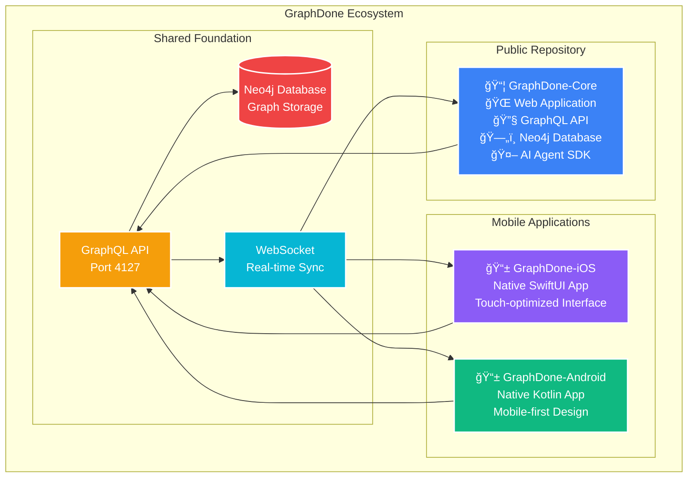

# GraphDone
**Your Team's Todone List**

## 🚀 Public Repository & Documentation

 

> Connecting people of all thinking styles through a shared workspace where humans and intelligent machines collaborate naturally from day one. Open source project management that celebrates cognitive diversity and treats automation as a team member, not an afterthought.

## GraphDone Ecosystem

## Flexible Deployment Architecture

GraphDone's microservices can be distributed across multiple servers for scalability and reliability:

```mermaid
graph TB
    subgraph "Load Balancer"
        LB[🌐 Load Balancer<br/>nginx/haproxy]
    end
    
    subgraph "Web Servers (Multiple)"
        WEB1[🖥️ Web Server 1<br/>React App<br/>Port 3127]
        WEB2[🖥️ Web Server 2<br/>React App<br/>Port 3127]
        WEB3[🖥️ Web Server 3<br/>React App<br/>Port 3127]
    end
    
    subgraph "API Servers (Scalable)"
        API1[🔧 GraphQL API 1<br/>Node.js Server<br/>Port 4127]
        API2[🔧 GraphQL API 2<br/>Node.js Server<br/>Port 4127]
        API3[🔧 GraphQL API 3<br/>Node.js Server<br/>Port 4127]
    end
    
    subgraph "Database Cluster"
        NEO4J_PRIMARY[(🗄️ Neo4j Primary<br/>Read/Write<br/>Port 7687)]
        NEO4J_READ1[(🗄️ Neo4j Read Replica 1<br/>Read Only)]
        NEO4J_READ2[(🗄️ Neo4j Read Replica 2<br/>Read Only)]
    end
    
    subgraph "Supporting Services"
        REDIS[⚡ Redis Cache<br/>Session Storage<br/>Port 6379]
        MCP[🤖 MCP Server<br/>Claude Integration<br/>Port 3128]
        MONITOR[📊 Monitoring<br/>Prometheus/Grafana]
    end
    
    subgraph "External Clients"
        BROWSER[🌐 Web Browser]
        MOBILE[📱 Mobile Apps]
        AI[🤖 AI Agents]
    end
    
    BROWSER --> LB
    MOBILE --> LB
    AI --> LB
    
    LB --> WEB1
    LB --> WEB2 
    LB --> WEB3
    
    WEB1 --> API1
    WEB2 --> API2
    WEB3 --> API3
    
    API1 --> NEO4J_PRIMARY
    API2 --> NEO4J_READ1
    API3 --> NEO4J_READ2
    
    NEO4J_PRIMARY -.->|Replication| NEO4J_READ1
    NEO4J_PRIMARY -.->|Replication| NEO4J_READ2
    
    API1 --> REDIS
    API2 --> REDIS
    API3 --> REDIS
    
    AI --> MCP
    MCP --> NEO4J_PRIMARY
    
    MONITOR --> API1
    MONITOR --> API2 
    MONITOR --> API3
    MONITOR --> NEO4J_PRIMARY
    
    style LB fill:#ff6b6b,stroke:#fff,stroke-width:2px,color:#fff
    style WEB1 fill:#4ecdc4,stroke:#fff,stroke-width:2px,color:#fff
    style WEB2 fill:#4ecdc4,stroke:#fff,stroke-width:2px,color:#fff
    style WEB3 fill:#4ecdc4,stroke:#fff,stroke-width:2px,color:#fff
    style API1 fill:#45b7d1,stroke:#fff,stroke-width:2px,color:#fff
    style API2 fill:#45b7d1,stroke:#fff,stroke-width:2px,color:#fff
    style API3 fill:#45b7d1,stroke:#fff,stroke-width:2px,color:#fff
    style NEO4J_PRIMARY fill:#f9ca24,stroke:#fff,stroke-width:2px,color:#fff
    style NEO4J_READ1 fill:#f0932b,stroke:#fff,stroke-width:2px,color:#fff
    style NEO4J_READ2 fill:#f0932b,stroke:#fff,stroke-width:2px,color:#fff
    style REDIS fill:#eb4d4b,stroke:#fff,stroke-width:2px,color:#fff
    style MCP fill:#6c5ce7,stroke:#fff,stroke-width:2px,color:#fff
```

**Deployment Benefits:**
- **🔄 High Availability** - Multiple instances eliminate single points of failure
- **📈 Auto-scaling** - Add more web/API servers based on load
- **🌍 Geographic Distribution** - Deploy closer to users worldwide
- **🔒 Security Isolation** - Separate database from public-facing services
- **⚡ Performance** - Read replicas and caching reduce response times

## Philosophy

GraphDone celebrates cognitive diversity by providing tools where different minds—human and AI—can collaborate naturally. Traditional project management forces everyone into the same workflow. We believe the best results come from teams where diverse thinking styles become strengths, not obstacles.

## Key Features

🧠 **Multiple Views** - Graph, list, calendar, or kanban - work how your mind works best  
🔗 **Natural Dependencies** - Connect tasks through real relationships, not artificial hierarchies  
⚡ **Focus-Friendly** - Deep-dive modes with gentle transitions for different attention styles  
🤖 **Human-AI Collaboration** - AI agents as team members, not afterthoughts

## Meet the Founders

### Matthew Valancy
**Co-Founder, Engineer**

  

*From Silicon Valley, California, Matthew has worked with engineering teams across every startup phase—from garage startups to IPO. He's observed that the most talented engineers are often self-directed individuals who thrive with autonomy, yet most management approaches are designed for workers who need constant oversight. GraphDone emerged from his belief that passionate, independent contributors deserve tools that amplify their strengths rather than constrain them.*

---

### Lakshman Patel
**Co-Founder, Engineer** 

  

*From a farming family in India that taught him hard work and seizing opportunities can transform lives, Lakshman brings that relentless drive to building technology. He champions rapidly adopting cutting-edge tools and methodologies to accelerate learning, continuously iterate on solutions, and deliver exceptional end-to-end experiences that exceed expectations.*

## Get Started

**[⭐ GraphDone-Core](https://github.com/GraphDone/GraphDone-Core)** - Open source web application and GraphQL API  
**[📖 Documentation](https://github.com/GraphDone/GraphDone-Core/tree/main/docs)** - Complete technical documentation and guides

**Tech Stack:** React, TypeScript, Node.js, GraphQL, Neo4j, Docker  
**License:** MIT - Open source and community-driven

---

**GraphDone** - For teams who think differently.

*Started by Matthew Valancy & Lakshman Patel*
