# GraphDone
**Your Team's Todone List**

## 🚀 Public Repository & Documentation

 

> Connecting people of all thinking styles through a shared workspace where humans and intelligent machines collaborate naturally from day one. Open source project management that celebrates cognitive diversity and treats automation as a team member, not an afterthought.

## GraphDone Ecosystem

```mermaid
graph TB
    subgraph "GraphDone Ecosystem"
        subgraph "Public Repository"
            CORE[📦 GraphDone-Core<br/>🌐 Web Application<br/>🔧 GraphQL API<br/>🗄️ Neo4j Database<br/>🤖 AI Agent SDK]
        end
        
        subgraph "Mobile Applications"
            IOS[📱 GraphDone-iOS<br/>Native SwiftUI App<br/>Touch-optimized Interface]
            ANDROID[📱 GraphDone-Android<br/>Native Kotlin App<br/>Mobile-first Design]
        end
        
        subgraph "Shared Foundation"
            API[GraphQL API<br/>Port 4127]
            DB[(Neo4j Database<br/>Graph Storage)]
            REALTIME[WebSocket<br/>Real-time Sync]
        end
    end
    
    CORE --> API
    API --> DB
    API --> REALTIME
    
    IOS --> API
    ANDROID --> API
    
    REALTIME --> IOS
    REALTIME --> ANDROID
    REALTIME --> CORE
    
    style CORE fill:#3b82f6,stroke:#fff,stroke-width:2px,color:#fff
    style IOS fill:#8b5cf6,stroke:#fff,stroke-width:2px,color:#fff
    style ANDROID fill:#10b981,stroke:#fff,stroke-width:2px,color:#fff
    style API fill:#f59e0b,stroke:#fff,stroke-width:2px,color:#fff
    style DB fill:#ef4444,stroke:#fff,stroke-width:2px,color:#fff
    style REALTIME fill:#06b6d4,stroke:#fff,stroke-width:2px,color:#fff
```

## Our Philosophy

High-performing teams are full of brilliant minds that work differently—both human and machine. Some think in patterns and connections, others need to hyperfocus on details. Some thrive on rapid task-switching, others prefer deep, uninterrupted work. Some process information visually, others through movement or sound. Traditional tools force everyone into the same box, and treat automation as an awkward add-on. 

GraphDone provides a shared foundation where every type of mind—biological or digital—can contribute in their most natural way toward goals that benefit everyone.

## Key Features

### 🧠 **Multiple Thinking Modes**
Visual graphs, linear lists, detail views, big picture overviews - access your data the way your mind works best.

### 🔗 **Non-Linear Workflows** 
Jump between tasks naturally. Perfect for minds that think in connections rather than sequential steps.

### 👥 **Strengths-Based Teams**
Different minds see different solutions. Our tools help diverse thinkers collaborate without masking their natural styles.

### ⚡ **Hyperfocus Friendly**
Deep-dive modes for intense focus sessions, plus gentle transitions to help you surface when ready.

### 🛡️ **Sensory Considerations**
Customizable interfaces, reduced cognitive load, and calm design that doesn't overwhelm sensitive processing styles.

### 🌐 **Pattern Recognition**
Visualize complex relationships and dependencies in ways that make sense to pattern-oriented minds.

## How It Works

1. **Shared Data, Personal Views** - Everyone works with the same information, but sees and interacts with it in their preferred style - graphs, lists, calendars, or kanban boards.

2. **Natural Connections** - Link tasks through real dependencies and relationships, not artificial hierarchies that don't match how minds actually work.

3. **Adaptive Interfaces** - Customize sensory inputs, interaction patterns, and information density to match your processing preferences.

4. **Celebrate Differences** - Different thinking styles become team strengths rather than obstacles to overcome.

## Meet the Founders

### Matthew Valancy
**Co-Founder, Engineer**

  

*From Silicon Valley, California, Matthew has worked with engineering teams across every startup phase—from garage startups to IPO. He's observed that the most talented engineers are often self-directed individuals who thrive with autonomy, yet most management approaches are designed for workers who need constant oversight. GraphDone emerged from his belief that passionate, independent contributors deserve tools that amplify their strengths rather than constrain them.*

---

### Lakshman Patel
**Co-Founder, Engineer** 

  

*From a farming family in India that taught him hard work and seizing opportunities can transform lives, Lakshman brings that relentless drive to building technology. He champions rapidly adopting cutting-edge tools and methodologies to accelerate learning, continuously iterate on solutions, and deliver exceptional end-to-end experiences that exceed expectations.*

## Open Source Philosophy

GraphDone's core services and applications are open source, reflecting our commitment to transparent, community-driven development for human collaboration tools. We believe the best tools for human-machine collaboration should be accessible to everyone.

## Getting Started

GraphDone is currently in development. To stay updated:

- ⭐ **Star this repository** to get notified of releases
- 📧 **Join our community** for early access updates

## Tech Stack

- **Frontend**: React, TypeScript, D3.js for graph visualization
- **Backend**: Node.js, GraphQL, Neo4j
- **Infrastructure**: Docker, Kubernetes
- **Testing**: Playwright, Vitest

## Project Structure

### Open Source Repository
**[GraphDone-Core](https://github.com/GraphDone/GraphDone-Core)** - Main application and services ([📖 Documentation](https://github.com/GraphDone/GraphDone-Core/tree/main/docs))
- `packages/core/` - Graph engine and algorithms  
- `packages/web/` - React web application
- `packages/server/` - GraphQL API server
- `packages/mcp-server/` - Claude Code integration

### Mobile Applications
- **GraphDone-iOS** - Native SwiftUI application with touch-optimized graph interface
- **GraphDone-Android** - Native Kotlin application with mobile-first design

## Contributing

We welcome contributions from developers who share our vision of cognitive-inclusive technology. More contribution guidelines coming soon.

## License

GraphDone-Core is MIT licensed. More info in the repo.

---

**GraphDone** - For teams who think differently.

*Started by Matthew Valancy & Lakshman Patel*
